# Morgen-Mobility · 8 Minuten

Fokus: **Haltung, Schulter, Hüftrotation.** Jeden Morgen direkt nach dem Aufstehen.

| Zeit | Ablauf |
|---|---|
| 6:30 | Aufstehen, Licht an, großes Glas Wasser |
| 6:33 | **Mobility (diese Seite)** |
| 6:41 | Atmen, 3 Min.: Cyclic Sighing (2× durch die Nase ein, lang durch den Mund aus) |
| 6:45 | Lauwarm duschen, eincremen |
| 6:55 | Frühstück |
| 7:15 | Zu Fuß ins Büro |

> 🟠 Orange = der Teil, der sich bewegt. Die Zeichnungen zeigen das Prinzip, die Videos die genaue Technik.

---

## 1 · Katze-Kuh · 8 Wdh.
Wirbelsäule aufwecken. Mit dem Atem bewegen: einatmen = Kuh, ausatmen = Katze.

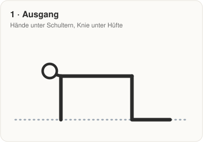 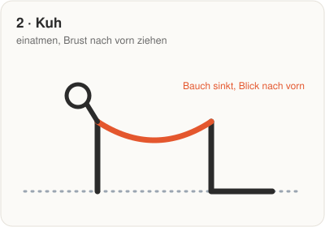 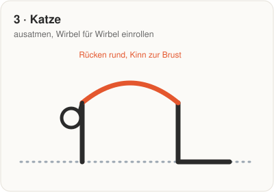

▶️ [Anleitung Physitrack](https://www.physitrack.com/exercise-library/how-to-perform-the-cat-cow-exercise) · [Cleveland Clinic](https://health.clevelandclinic.org/cat-cow-stretch)

## 2 · Open Book · 5 pro Seite
Drehung der Brustwirbelsäule. Knie bleiben übereinander am Boden, nur der Oberkörper dreht.

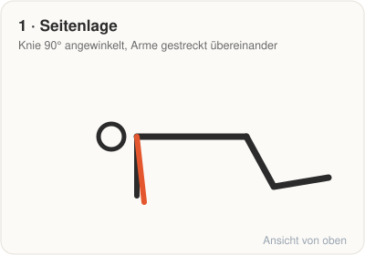 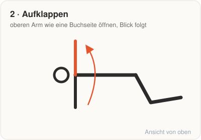 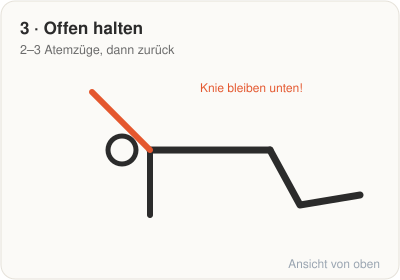

▶️ [Video YouTube](https://www.youtube.com/watch?v=hElN9Yj7qjk) · [Physitrack](https://us.physitrack.com/home-exercise-video/thoracic-rotation-in-side-lying)

## 3 · Wandengel · 10 Wdh.
Haltung und Schulterblätter. Rücken, Hinterkopf und Ellbogen bleiben an der Wand. Kein Hohlkreuz.

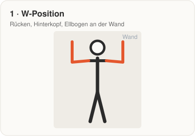 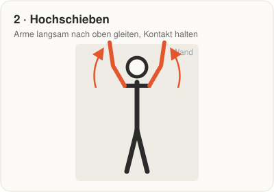 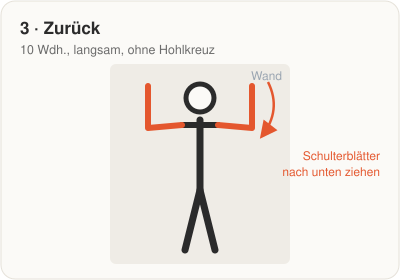

▶️ [Anleitung Physitrack](https://www.physitrack.com/exercise-library/how-to-perform-the-wall-angels-exercise) · [Rehab Hero](https://www.rehabhero.ca/exercise/wall-angel)

## 4 · Y-T-Raises · 8 Wdh.
Stärkt den oberen Rücken, das wichtigste Gegengewicht zu runden Schultern. Klein und kontrolliert.

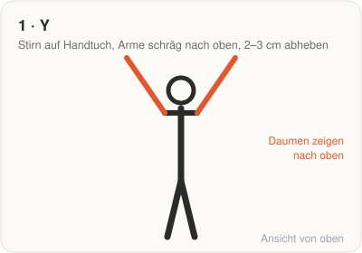 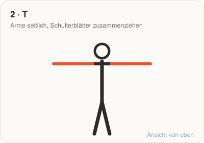 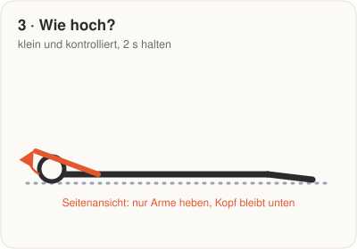

▶️ [Video YouTube](https://www.youtube.com/watch?v=DQFTp5n0uh0) · [Physitrack](https://ca.physitrack.com/home-exercise-video/prone-back-extension-and-y-raise)

## 5 · 90/90 + Knie-Lift · 8 Wechsel, dann 5 pro Seite
Hüftrotation. Aufrecht sitzen, Füße bleiben beim Wechseln am Boden. Am Ende das hintere Knie aktiv 2–3 cm heben (Innenrotation).

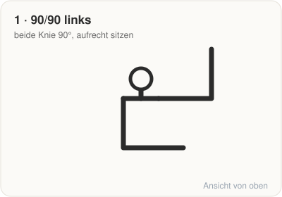 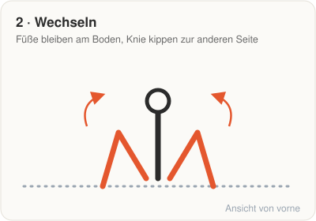 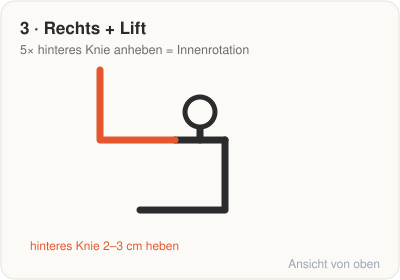

▶️ [Video 90/90 Switch](https://www.youtube.com/watch?v=HUZimFZJZWU) · [Video Lift (Innenrotation)](https://www.youtube.com/watch?v=LrtsqQAoLuM)

## 6 · Tiefe Hocke · 45 s halten
Fersen bleiben unten, ruhig atmen. Ellbogen drücken die Knie sanft nach außen.

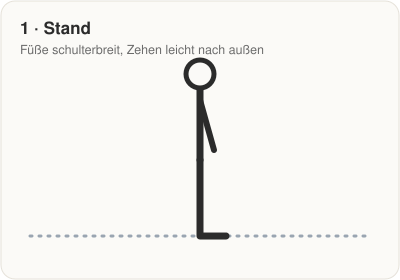 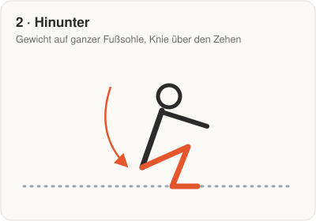 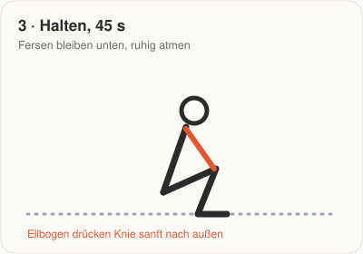

▶️ [Hinge Health](https://www.hingehealth.com/resources/articles/benefits-of-deep-squat/) · [Prehab Guys](https://theprehabguys.com/blog/must-do-exercises-to-squat-deep/)

## 7 · Dead Hang / Scapula-Pull-ups · 30 s oder 8 Wdh.
Schultern entlasten und stabilisieren. Arme bleiben gestreckt, nur die Schulterblätter ziehen nach unten.

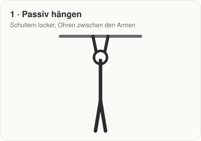 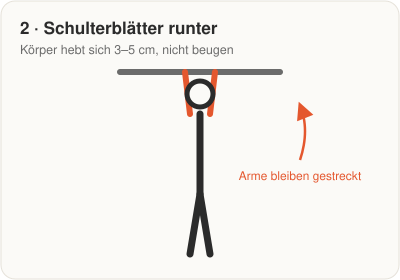 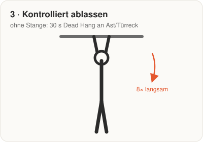

▶️ [Video YouTube](https://www.youtube.com/watch?v=V0hzdT1CZnk) · [Rehab Hero](https://www.rehabhero.ca/exercise/scapular-pull-ups)

---

### 💡 Für die Haltung
Kraft bringt mehr als Dehnen. In den Calisthenics-Einheiten 2× pro Woche **Australian Pull-ups oder Rudern** einbauen.

*Illustrationen: eigene Zeichnungen. Videos und Anleitungen: verlinkte Quellen.*
